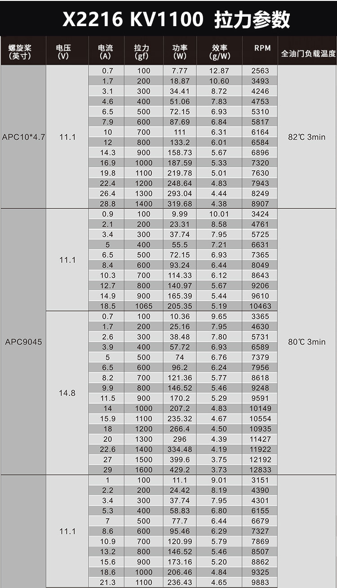
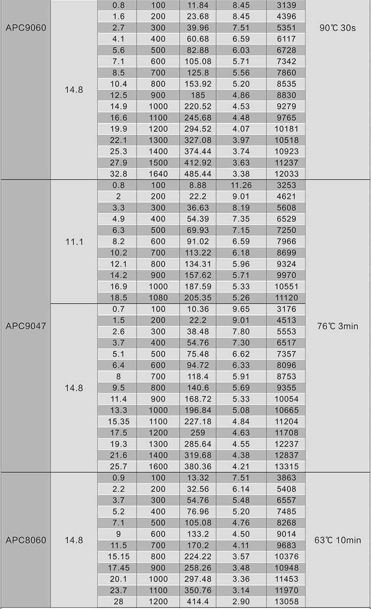

### T265 相机

1. 需要软安装/减震板，相机输出结果对高频振动很敏感
2. 固定前视，不被脚架等其他结构遮挡视野

### D435 相机

1. 前视相机

### LD14P 雷达

1. 二维平面内没有无人机的机械结构遮挡，可放置于飞机最上方正中间

### MTF-01 光流&激光测距一体模块

1. 朝向地面

### NUC11TNK 机载电脑

1. 底板可拆卸，内有M4通孔

### V5nano 飞控

1. 3M胶固定
2. 可能需要减震安装，目前未发现由飞控高频振动引起的飞行问题

### T-Motor 2216 电机

---

### 重量

锂电池：250g

NUC：504g

飞控：40g

D435: 72g

t265: 55g

雷达：135g

### 动力套搭配

四旋翼模型：轴距400

电机：朗宇X2216 KV1100

电调：EMAX 45A分体电调

桨叶：9047

